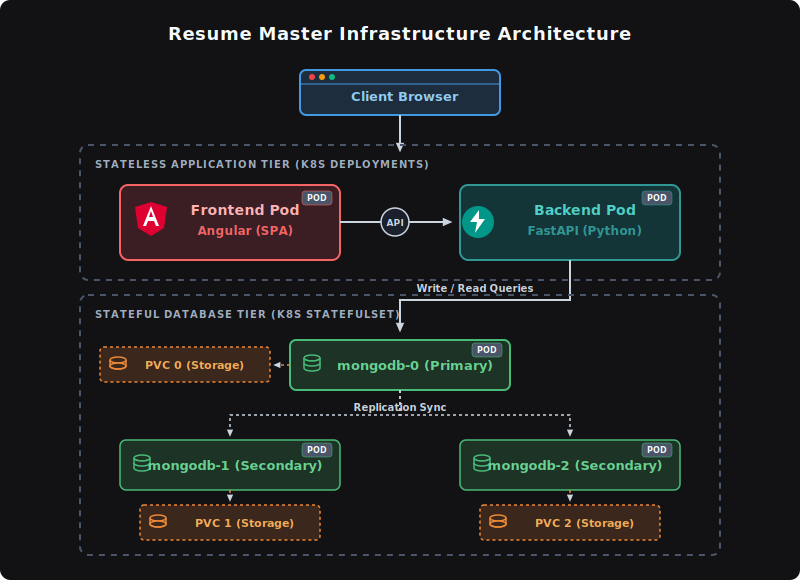

# Resume Master

[](https://kubernetes.io/)
[](https://www.mongodb.com/)
[](https://www.docker.com/)
[](https://fastapi.tiangolo.com/)
[](https://angular.dev/)

**Resume Master** is a learning project designed to simplify the creation of smart resumes tailored for specific job advertisements. The platform integrates a user's entire professional history—including experiences, skills, and achievements—into a single interface. It also tracks and manages the current work domains for an incremental set of diverse organizations.

---

## Key Features

- **Unified Portfolio Management:** Consolidates all professional achievements, skills, and work histories in one place.
- **Tailored Resume Generation:** Facilitates the customization of resumes to match specific job descriptions.
- **Organization & Domain Tracking:** Stores and manages incremental domain data for various organizations to keep job histories contextual and accurate.
- **Containerized Architecture:** Fully dockerized components orchestrated via Kubernetes.

---

## Architecture & Deployment

The application is split into stateless and stateful tiers to optimize scaling and persistent storage management within a Kubernetes cluster.

<p align="center">
  
</p>

### 1. Stateless Tier (Kubernetes Deployments)
The application logic is separated into two decoupled, stateless services managed by standard Kubernetes **Deployments**:
- **Frontend:** Serves the user interface.
- **Backend:** Exposes APIs to handle data processing, resume generation, and database queries.

### 2. Stateful Tier (Kubernetes StatefulSets)
To ensure reliable data retention and management, **MongoDB** is deployed using a Kubernetes **StatefulSet**:
- **Persistent Storage:** Bound to PersistentVolumeClaims (PVCs) to preserve resume and domain data across pod restarts.
- **Simplified Database Access:** Orchestrates multiple MongoDB instances pointing to a single logical database, facilitating reliable database configurations.

Both tiers can scale horizontally based on demand.

---

## Tech Stack

- **Frontend:** [Angular]
- **Backend:** [Python, FastAPI library]
- **Database:** [MongoDB]
- **Containerization & Orchestration:** [Docker, Kubernetes (Deployments, StatefulSets, Services, Persistent Volumes)]

---

### Getting Started

Follow these steps to deploy and run the system locally inside a Kubernetes environment.

#### Prerequisites

Ensure you have the following installed on your machine:
- [Docker](https://docs.docker.com/get-docker/)
- [kubectl](https://kubernetes.io/docs/tasks/tools/)
- [FastAPI](https://fastapi.tiangolo.com/#installation) (Install via Python: `pip install "fastapi[standard]"`)
- [Angular CLI](https://angular.dev/tools/cli/setup) (Install globally via Node.js/npm: `npm install -g @angular/cli`)
- A local Kubernetes cluster tool, such as [Kind](https://kind.sigs.k8s.io/docs/user/quick-start/) or [Minikube](https://minikube.sigs.k8s.io/docs/start/) 

---

#### Local Deployment Steps

##### 1. Clone the Repository
```bash
git clone https://github.com/francesco-monzillo/Resume-Master.git
cd Resume-Master
```

##### 2. Start the Local Kubernetes Cluster
If you are using Kind, initialize the local cluster:
```bash
./Cluster_Resources/cluster_creation.bat
```

##### 3. Deploy the Application
Deploy the storage configurations and the MongoDB StatefulSet. It is important to deploy the database tier first so that the backend can resolve database connections upon initialization.

```bash
#Enter the Kubernetes_Resources folder and then execute the .bat file inside
./configuration.bat
```

##### 4. Establish a Replica Set among MongoDB instances
First, start an interactive shell inside the mongodb-0 pod while running:
```bash
kubectl exec -it mongodb-0 -- bash
```
Then, execute these 2 lines and then close the shell:
```bash
mongosh
```
```bash
rs.initiate({`
  _id: "rs0",`
  members: [`
    { _id: 0, host: "mongodb-0.mongodb-service.resume-master.svc.cluster.local:27017" },`
    { _id: 1, host: "mongodb-1.mongodb-service.resume-master.svc.cluster.local:27017" },`
    { _id: 2, host: "mongodb-2.mongodb-service.resume-master.svc.cluster.local:27017" }`
  ]`
})
```

##### 5. Verify Running Resources
Monitor the cluster components to ensure all pods reach the `Running` state:

```bash
# Get the status of all pods, services, and statefulsets
kubectl get all
```

##### 6. Access the Application
Since the NodePort Service is hosted on port 30080 and hostPort and containerPort configured through kind-config.yaml are 30080 and 8080, respectively, in the browser you can access the app locally through:
```bash
http://localhost:8080/
```
